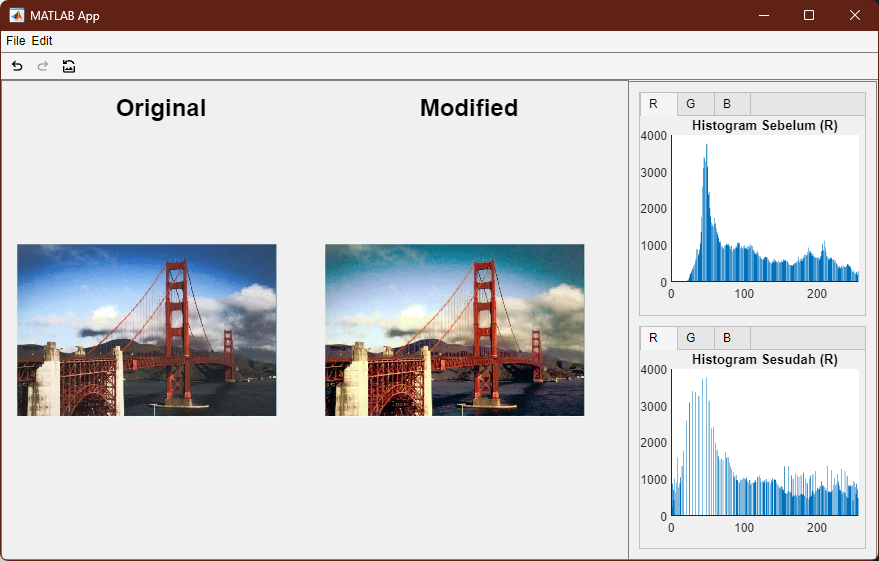

<<<<<<< HEAD
Run program by running `ui/pengcit.mlapp` in MATLAB App Designer.
=======
# Tugas Besar 1

## IF4073 Interpretasi dan Pengolahan Citra

Cara menjalankan

- Jalankan file `pengcit.mlapp` pada folder `ui` menggunakan MATLAB
>>>>>>> 5268b8ae0ca490f4343d14d4da8d1b58ea35d1fe
